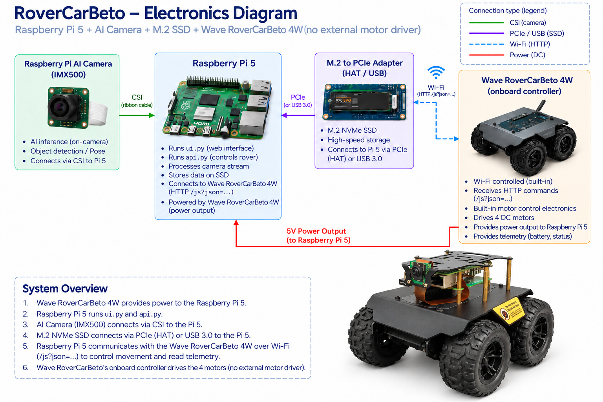
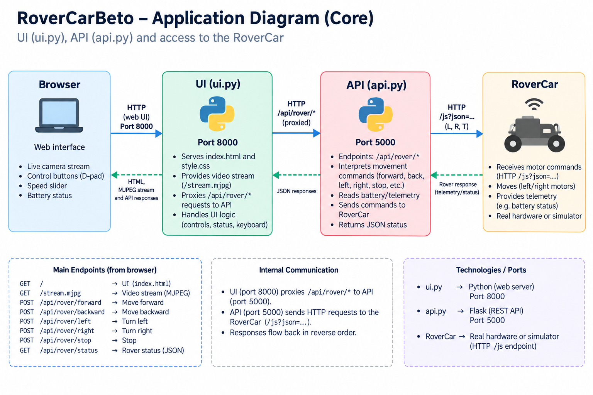
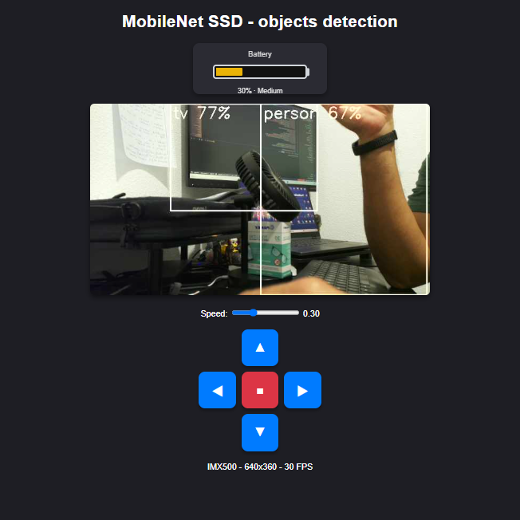
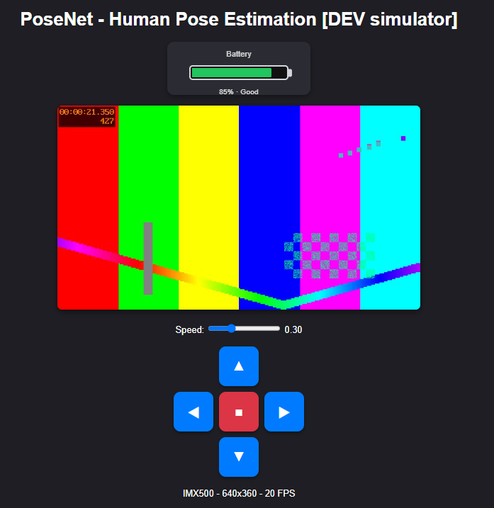
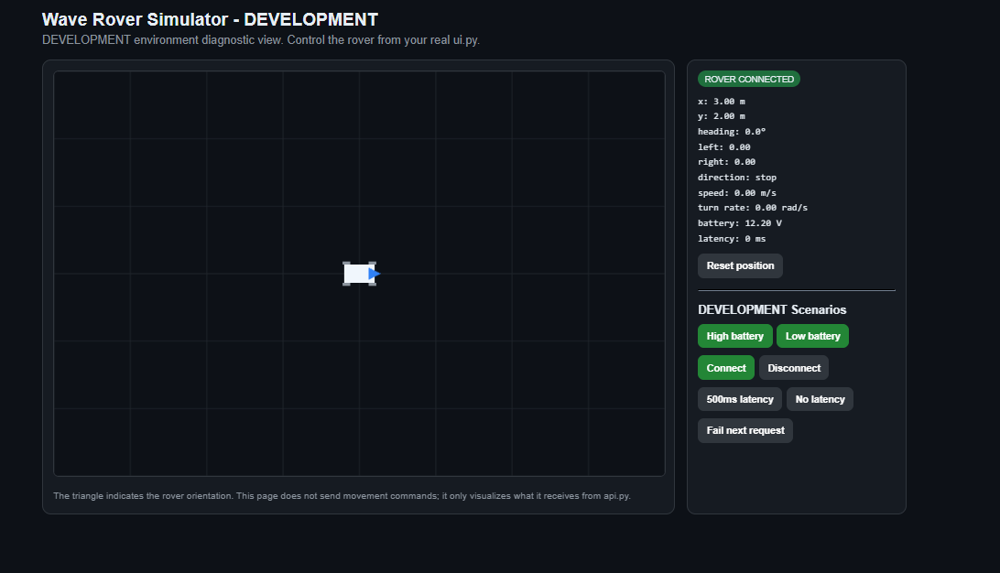
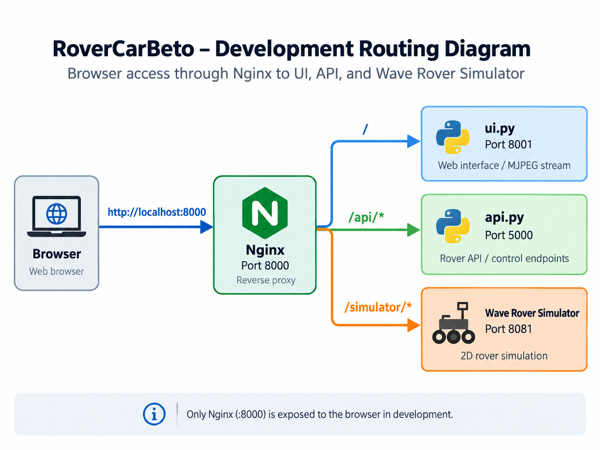
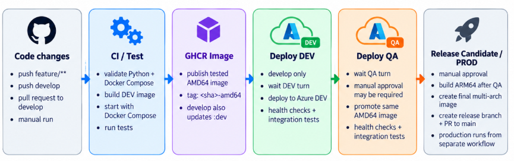

# RoverCarBeto

RoverCarBeto is a 4WD mobile robot based on the Waveshare Wave Rover chassis and a Raspberry Pi 5.

The project combines remote rover control, live video streaming, AI-based camera processing, telemetry, and local SSD storage.

The Raspberry Pi 5 runs the web interface and the rover API. It communicates with the Wave Rover onboard controller over Wi-Fi using HTTP commands. The Raspberry Pi AI Camera (IMX500) is used for computer vision tasks such as object detection and pose estimation.

## System Architecture

The following diagram shows the software architecture of RoverCarBeto, including the web interface, API, and communication with the rover.

## Electronics Architecture

The electronics architecture includes:

- Raspberry Pi 5
- Raspberry Pi AI Camera (IMX500)
- M.2 / PCIe SSD adapter
- NVMe SSD
- Waveshare Wave Rover 4WD Mobile Robot Chassis

The Wave Rover provides power to the Raspberry Pi and contains its own onboard motor-control electronics, so no external motor driver is required.

RoverCarBeto includes a complete development environment that allows the
application to run without requiring the physical Wave Rover or IMX500 camera.

## Development Architecture

The development environment runs four services inside the Docker container:

- **Nginx** — port `8000`  
  Public entry point for the application.

- **UI (`ui.py`)** — port `8001`  
  Provides the web interface and MJPEG camera stream.

  

- **API (`api.py`)** — port `5000`  
  Handles movement commands, rover status and battery telemetry.

- **Wave Rover Simulator** — port `8081`  
  Simulates the Wave Rover controller, movement, battery, latency and failures.

  **_(UI simulator)_**

  

  

## CI/CD Diagram 
